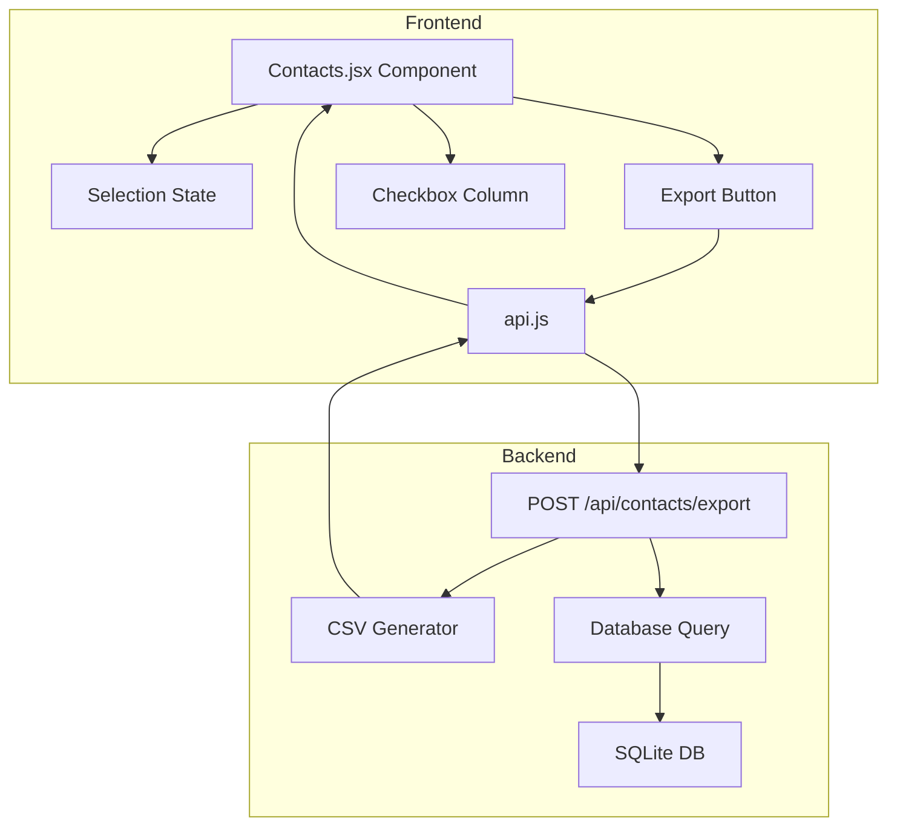
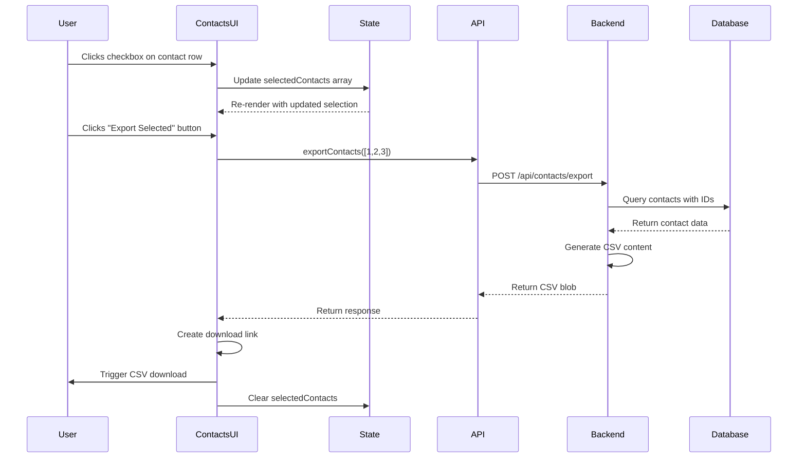

# CSV Export Feature - Technical Architecture

## Component Architecture



## Data Flow Sequence



## State Management

### Contacts Component State

```javascript
// Existing state
const [contacts, setContacts] = useState([]);
const [companies, setCompanies] = useState([]);
const [availableTags, setAvailableTags] = useState([]);
const [loading, setLoading] = useState(true);
const [showModal, setShowModal] = useState(false);
const [editingContact, setEditingContact] = useState(null);
const [formData, setFormData] = useState(getInitialFormData());
const [filters, setFilters] = useState(getInitialFilters());
const [filtersCollapsed, setFiltersCollapsed] = useState(false);

// NEW: Selection state for CSV export
const [selectedContacts, setSelectedContacts] = useState([]);
const [isExporting, setIsExporting] = useState(false);
```

## API Contract

### Request Format

```http
POST /api/contacts/export HTTP/1.1
Authorization: Bearer <token>
Content-Type: application/json

{
  "contact_ids": [1, 2, 3, 4, 5]
}
```

### Response Format

```http
HTTP/1.1 200 OK
Content-Type: text/csv; charset=utf-8
Content-Disposition: attachment; filename="contacts-export-2026-06-17.csv"

FirstName,LastName,Email,Company
John,Doe,john.doe@example.com,Acme Corp
Jane,Smith,jane.smith@techco.com,TechCo Inc
```

### Error Responses

```http
HTTP/1.1 400 Bad Request
Content-Type: application/json

{
  "error": "No contact IDs provided"
}
```

```http
HTTP/1.1 401 Unauthorized
Content-Type: application/json

{
  "error": "Authentication required"
}
```

```http
HTTP/1.1 403 Forbidden
Content-Type: application/json

{
  "error": "You do not have permission to export these contacts"
}
```

## CSV Generation Algorithm

```javascript
function generateCSV(contacts) {
  // 1. Define headers
  const headers = ['FirstName', 'LastName', 'Email', 'Company'];
  
  // 2. Escape function for CSV values
  const escapeCSV = (value) => {
    if (value == null) return '';
    const stringValue = String(value);
    // If contains comma, quote, or newline, wrap in quotes and escape quotes
    if (stringValue.includes(',') || stringValue.includes('"') || stringValue.includes('\n')) {
      return `"${stringValue.replace(/"/g, '""')}"`;
    }
    return stringValue;
  };
  
  // 3. Build CSV rows
  const rows = contacts.map(contact => [
    escapeCSV(contact.first_name),
    escapeCSV(contact.last_name),
    escapeCSV(contact.email),
    escapeCSV(contact.company_name)
  ].join(','));
  
  // 4. Combine headers and rows
  return [headers.join(','), ...rows].join('\n');
}
```

## Security Implementation

### Backend Validation

```javascript
// Verify user owns all requested contacts
const verifyContactOwnership = async (userId, contactIds) => {
  const placeholders = contactIds.map(() => '?').join(',');
  const query = `
    SELECT COUNT(*) as count 
    FROM contacts 
    WHERE id IN (${placeholders}) 
      AND user_id = ?
  `;
  
  const result = await dbGet(query, [...contactIds, userId]);
  return result.count === contactIds.length;
};
```

### Input Validation

```javascript
// Validate request body
if (!Array.isArray(contact_ids) || contact_ids.length === 0) {
  return res.status(400).json({ error: 'No contact IDs provided' });
}

// Validate all IDs are numbers
if (!contact_ids.every(id => Number.isInteger(id) && id > 0)) {
  return res.status(400).json({ error: 'Invalid contact IDs' });
}

// Limit maximum export size (optional)
if (contact_ids.length > 1000) {
  return res.status(400).json({ error: 'Too many contacts selected (max 1000)' });
}
```

## UI Component Structure

```
Contacts Component
├── Page Header
│   ├── Title: "Contacts"
│   ├── Export Button (NEW)
│   │   ├── Text: "Export Selected (N)"
│   │   ├── Disabled when N = 0
│   │   └── onClick: handleExportSelected
│   └── Add Contact Button
│
├── Filters Card
│   └── [Existing filter UI]
│
└── Contacts Table
    ├── Table Header
    │   ├── Checkbox Column (NEW)
    │   │   └── Select All Checkbox
    │   ├── Name Column
    │   ├── Company Column
    │   ├── Lead Status Column
    │   ├── Tags Column
    │   ├── Email Column
    │   ├── Phone Column
    │   ├── Last Outreach Column
    │   └── Actions Column
    │
    └── Table Body
        └── Contact Rows
            ├── Checkbox Cell (NEW)
            │   └── Individual Selection Checkbox
            ├── Name Cell
            ├── Company Cell
            ├── Lead Status Cell
            ├── Tags Cell
            ├── Email Cell
            ├── Phone Cell
            ├── Last Outreach Cell
            └── Actions Cell
```

## CSS Styling Considerations

### Checkbox Column Styling

```css
/* Checkbox column should be narrow and centered */
.contacts-col-checkbox {
  width: 40px;
  text-align: center;
  padding: 0.5rem;
}

.contacts-col-checkbox input[type="checkbox"] {
  cursor: pointer;
  width: 16px;
  height: 16px;
}

/* Export button styling */
.btn-export {
  margin-left: 0.5rem;
}

.btn-export:disabled {
  opacity: 0.5;
  cursor: not-allowed;
}
```

## Performance Considerations

1. **Frontend Selection State**: Using array of IDs is efficient for reasonable contact counts (< 10,000)
2. **Backend Query**: Using `IN` clause with parameterized queries is safe and performant
3. **CSV Generation**: String concatenation is acceptable for typical export sizes
4. **Memory Usage**: CSV is generated in-memory; for very large exports, consider streaming

## Testing Strategy

### Unit Tests (Backend)

```javascript
describe('CSV Export Endpoint', () => {
  test('should generate valid CSV for single contact', async () => {
    // Test implementation
  });
  
  test('should escape special characters in CSV', async () => {
    // Test implementation
  });
  
  test('should reject unauthorized access', async () => {
    // Test implementation
  });
  
  test('should validate contact ownership', async () => {
    // Test implementation
  });
});
```

### Integration Tests (Frontend)

```javascript
describe('Contact Selection and Export', () => {
  test('should select individual contacts', () => {
    // Test implementation
  });
  
  test('should select all contacts', () => {
    // Test implementation
  });
  
  test('should export selected contacts', async () => {
    // Test implementation
  });
  
  test('should clear selection after export', async () => {
    // Test implementation
  });
});
```

## Deployment Checklist

- [ ] Backend endpoint implemented and tested
- [ ] CSV generation utility tested with edge cases
- [ ] Frontend UI components added
- [ ] Selection state management working
- [ ] Download functionality tested in multiple browsers
- [ ] Security validation in place
- [ ] Error handling implemented
- [ ] User feedback mechanisms working
- [ ] Documentation updated
- [ ] Code reviewed and approved

## Browser Compatibility

The implementation uses standard Web APIs that are supported in:
- ✓ Chrome/Edge (latest)
- ✓ Firefox (latest)
- ✓ Safari (latest)
- ✓ Mobile browsers (iOS Safari, Chrome Mobile)

Key APIs used:
- `Blob` API for file creation
- `URL.createObjectURL()` for download links
- `fetch` API for HTTP requests (via axios)