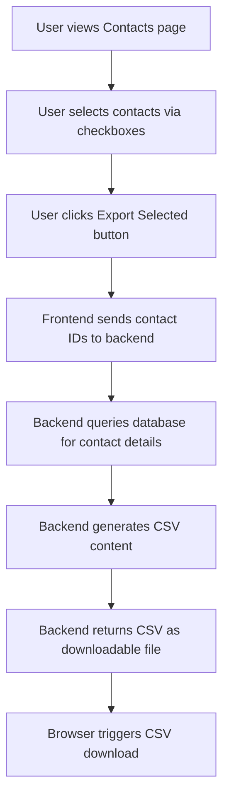

# CSV Export Feature - Implementation Plan

## Overview
Add the ability to select multiple contacts and export them to a CSV file for mail-merge workflows.

## CSV Format
The exported CSV will contain the following columns:
- **FirstName**: Contact's first name
- **LastName**: Contact's last name
- **Email**: Contact's email address
- **Company**: Associated company name

## User Experience Flow



## Implementation Details

### 1. Backend API Endpoint

**Endpoint**: `POST /api/contacts/export`

**Request Body**:
```json
{
  "contact_ids": [1, 2, 3, 4]
}
```

**Response**:
- Content-Type: `text/csv`
- Content-Disposition: `attachment; filename="contacts-export-YYYY-MM-DD.csv"`
- Body: CSV formatted data

**Implementation Location**: [`backend/server.js`](backend/server.js)

**Key Logic**:
1. Validate user authentication
2. Verify contact IDs belong to the authenticated user
3. Query database for contact details with company names
4. Generate CSV with proper escaping for special characters
5. Return CSV with appropriate headers

**SQL Query**:
```sql
SELECT 
  c.first_name,
  c.last_name,
  c.email,
  co.name as company_name
FROM contacts c
JOIN companies co ON c.company_id = co.id
WHERE c.id IN (?, ?, ?) 
  AND c.user_id = ?
ORDER BY c.last_name, c.first_name
```

### 2. CSV Generation Utility

**Function**: `generateCSV(contacts)`

**Features**:
- Proper CSV escaping (quotes, commas, newlines)
- UTF-8 encoding support
- RFC 4180 compliant format

**Example Output**:
```csv
FirstName,LastName,Email,Company
John,Doe,john.doe@example.com,Acme Corp
Jane,Smith,jane.smith@techco.com,TechCo Inc
```

### 3. Frontend API Integration

**File**: [`frontend/src/api.js`](frontend/src/api.js)

**New Function**:
```javascript
export const exportContacts = (contactIds) => 
  api.post('/contacts/export', { contact_ids: contactIds }, {
    responseType: 'blob'
  });
```

### 4. Frontend UI Changes

**File**: [`frontend/src/components/Contacts.jsx`](frontend/src/components/Contacts.jsx)

#### State Management
Add new state variables:
```javascript
const [selectedContacts, setSelectedContacts] = useState([]);
```

#### Selection Functions
- `handleSelectAll()`: Toggle all visible contacts
- `handleSelectContact(contactId)`: Toggle individual contact
- `handleExportSelected()`: Trigger CSV export
- `clearSelection()`: Clear all selections

#### UI Components

**1. Checkbox Column in Table Header**
```jsx
<th className="contacts-col-checkbox">
  <input
    type="checkbox"
    checked={selectedContacts.length === contacts.length && contacts.length > 0}
    onChange={handleSelectAll}
  />
</th>
```

**2. Checkbox in Each Row**
```jsx
<td className="contacts-col-checkbox">
  <input
    type="checkbox"
    checked={selectedContacts.includes(contact.id)}
    onChange={() => handleSelectContact(contact.id)}
  />
</td>
```

**3. Export Button in Page Header**
```jsx
<button 
  className="btn btn-secondary" 
  onClick={handleExportSelected}
  disabled={selectedContacts.length === 0}
>
  Export Selected ({selectedContacts.length})
</button>
```

### 5. CSV Download Logic

**Implementation**:
```javascript
const handleExportSelected = async () => {
  try {
    const response = await exportContacts(selectedContacts);
    const blob = new Blob([response.data], { type: 'text/csv' });
    const url = window.URL.createObjectURL(blob);
    const link = document.createElement('a');
    link.href = url;
    link.download = `contacts-export-${new Date().toISOString().split('T')[0]}.csv`;
    document.body.appendChild(link);
    link.click();
    document.body.removeChild(link);
    window.URL.revokeObjectURL(url);
    setSelectedContacts([]); // Clear selection after export
  } catch (error) {
    console.error('Error exporting contacts:', error);
    alert('Failed to export contacts');
  }
};
```

### 6. Visual Feedback

**Selection Count Display**:
- Show count in export button text: "Export Selected (3)"
- Disable button when no contacts selected
- Clear selection after successful export

**User Feedback**:
- Loading state during export
- Success message (optional)
- Error handling with user-friendly messages

## Edge Cases to Handle

1. **No contacts selected**: Disable export button
2. **All contacts selected**: Show "Select All" checkbox as checked
3. **Partial selection**: Show "Select All" checkbox as indeterminate (optional enhancement)
4. **Empty email fields**: Export empty string or "N/A"
5. **Special characters in data**: Proper CSV escaping (quotes, commas, newlines)
6. **Large selections**: Consider pagination or limits (current implementation should handle reasonable sizes)
7. **Filter changes**: Optionally clear selection when filters change

## Testing Scenarios

1. ✓ Select single contact and export
2. ✓ Select multiple contacts and export
3. ✓ Use "Select All" to export all visible contacts
4. ✓ Export contacts with special characters in names/emails
5. ✓ Export contacts with missing email addresses
6. ✓ Verify CSV format is compatible with mail-merge tools
7. ✓ Test with filtered contact list
8. ✓ Verify only user's own contacts are exported (security)
9. ✓ Test export button disabled state
10. ✓ Verify selection clears after export

## Security Considerations

- ✓ Verify user authentication on backend endpoint
- ✓ Ensure users can only export their own contacts
- ✓ Validate contact IDs exist and belong to user
- ✓ Sanitize CSV output to prevent CSV injection attacks
- ✓ Rate limiting on export endpoint (optional enhancement)

## Future Enhancements

- Export all filtered contacts (without manual selection)
- Additional export formats (Excel, vCard)
- Custom column selection
- Export with additional fields (phone, position, etc.)
- Scheduled/automated exports
- Export templates for different mail-merge tools

## Files to Modify

1. [`backend/server.js`](backend/server.js) - Add export endpoint and CSV generation
2. [`frontend/src/api.js`](frontend/src/api.js) - Add exportContacts function
3. [`frontend/src/components/Contacts.jsx`](frontend/src/components/Contacts.jsx) - Add selection UI and export logic
4. [`frontend/src/index.css`](frontend/src/index.css) - Add checkbox column styling (if needed)

## Estimated Complexity

- **Backend**: Low-Medium (straightforward endpoint with CSV generation)
- **Frontend**: Medium (state management, UI updates, download logic)
- **Testing**: Low (standard CRUD testing patterns)

**Total Effort**: 2-3 hours for implementation and testing